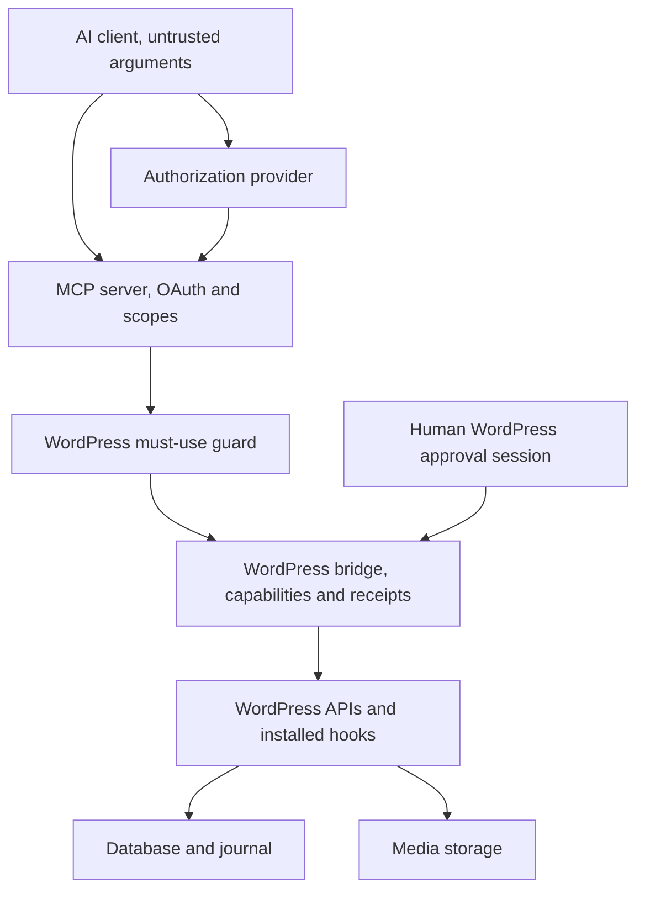

# Architecture

Gate 0 established the component split. The detailed Gate 1 design below is a review candidate until human acceptance. No implementation exists.

## Components and authority

The TypeScript MCP server uses an official SDK, with a pinned version selected and verified in Gate 4. It owns client authentication, fixed tool schemas, scopes, protective limits, bridge request shaping, safe errors and audit correlation. It has no WordPress database credential or filesystem access. It never directly modifies the database/files or exposes a generic REST proxy.

The WordPress PHP package contains a minimal must-use guard and bridge feature handlers. The guard restricts dedicated service identities to the fixed bridge route table and remains effective when handlers are absent. The bridge independently owns WordPress authentication checks, native/custom capabilities, schema and operation validation, approvals, durable mutation deduplication, WordPress API calls, fresh readback and receipts. Installation must establish the guard before issuing a service credential.

An established, self-hostable OAuth provider handles login, consent and token issuance. Coagmentator is an OAuth resource server, not a new authorization-server implementation. Its compatibility contract is in [AUTHENTICATION.md](AUTHENTICATION.md).

Shared contracts live as design documentation in [CONTRACTS.md](CONTRACTS.md), [ERRORS.md](ERRORS.md) and [MCP-TOOLS.md](MCP-TOOLS.md). Implementation packages come later. Both components validate the same explicit contract version; neither infers meaning from undocumented WordPress REST fields.

## Trust boundaries

| Boundary | What crosses it | Enforced owner/control |
| --- | --- | --- |
| AI client to MCP | Untrusted JSON tool inputs, user-delegated access token | MCP validates token, subject/site binding, scopes, schema, limits and Origin; no model obedience assumption |
| Client/provider/MCP | OAuth discovery, callback and token state | Established provider plus client implement PKCE/issuer/redirect checks; MCP pins issuer/audience and validates every access token |
| MCP to bridge | Fixed HTTPS route, dedicated Application Password, versioned envelope | Guard checks identity/route; bridge independently enforces native/custom capabilities, site, policy and request validity. Claimed actor is audit context, not extra authority |
| Human browser to approval UI | Cookie session, CSRF nonce, explicit approval POST | Bridge requires a non-service human identity, approval and underlying capabilities, exact-intent binding and expiry. No MCP approval tool |
| Bridge to WordPress core/hooks | Validated narrow API call | WordPress capabilities remain authoritative; plugin hooks share its trust domain and can affect results. Verify actual readback |
| WordPress to database/files | Content, media, private approval payloads and audit journal | WordPress APIs for content; prepared internal journal operations only; no remote SQL or path input. Persistent unique reservation supports deduplication |
| External content/URLs/media | Raw post text, revisions, raster bytes, returned URLs | No raw-content execution, rendering, URL download or client-chosen destination. Decode/re-encode media with bounds; return URLs as untrusted data |

## Fixed deployment identity

The MVP has one site, one configured OAuth operator and one dedicated WordPress service identity per MCP instance. Bind the canonical MCP audience, approved issuer/subject, actor ID, bridge HTTPS endpoint, service-user/credential UUIDs, and random bridge site ID out of band. Tools never accept a site URL or credentials. Except for `site_info`, tools require the already-discovered site ID as an assertion, not a router. A site clone must receive a new ID and new credentials before use. Multisite and multiple-site routing require a later review.

WordPress Application Passwords do not provide this route boundary themselves. The mandatory guard closes native REST/XML-RPC/self-management bypasses; [CAPABILITIES.md](CAPABILITIES.md) documents the residual risk if a trusted operator removes the guard without revoking credentials.

## Mutation lifecycle

Validate transport/identity and operation authority before disclosing resource state. For a write, validate every field, persist the request hash and reservation, obtain any exact-intent human approval, claim execution once, acquire bounded bridge resource locks, reauthorize and recheck the version/editor lock, execute the narrow WordPress mutation, then read fresh state and compare intended/preserved fields. Persist and return a receipt only with the verification outcome actually observed.

Duplicate keys with changed intent are conflicts. Concurrent callers cannot share execution ownership. Timeout or crash after execution intent is recorded is indeterminate until reconciled; never steal the reservation or blindly run the mutation again. `get_mutation` only reads status. All mutation outputs distinguish applied, partial and unknown outcomes. No guarantee of exactly-once external hook effects, rollback across files/DB, or atomic concurrency with unrelated WordPress writers.

The bridge journal stores unique request keys, canonical hashes, ownership/state transitions, compact results and receipts for 90 days. Private pending approval payloads are separately access-controlled and erased within 24 hours, with 10-minute approval expiry. Logs contain no payload bodies or credentials. A crash may leave a partial media file or operation; the operator reconciles it instead of automatic destructive cleanup.

## MVP surface and content policy

Exactly 21 operations are defined in [MCP-TOOLS.md](MCP-TOOLS.md), with full authorization in [CAPABILITIES.md](CAPABILITIES.md). Ten are reads and eleven are mutations. Post/page lookup is unified, creation is draft-only, and publication and Trash are separate operations. Every mutation uses a stable request key; existing-resource writes require a current full-projection version.

Native capabilities plus custom operation caps provide least privilege. Write families default off. Live/private edits, publication, Trash, uploads, term edits and revision restore require independent human approval. Draft/term creation and non-live edits can operate under explicit standing authorization; their remaining misuse risk is documented.

Content reads return stored raw source without executing blocks/shortcodes. Writes support a fixed safe HTML/static-block subset. Media is bounded raster bytes, never URL sideloads. Metadata keys are fixed; optional bridge-owned basic SEO requires verified sole ownership of title/description output and does not claim compatibility with existing SEO vendors. These limitations are product scope, not hidden implementation exceptions.

## Repository and gate boundaries

Continue the monorepo layout planned in Gate 0: `apps/mcp-server/`, `wordpress/coagmentator/`, `packages/contracts/`, `tests/`, and `docs/`. Only documentation is created in Gate 1. Gate 2 builds the WordPress read foundation and must-use guard; Gate 3 builds mutations, approval UI and journal; Gate 4 builds the MCP/OAuth adapter. Gates 5 and 6 validate non-production then separately authorized production use. Do not silently implement a later gate.

[SECURITY.md](SECURITY.md) owns security invariants; [THREAT-MODEL.md](THREAT-MODEL.md) traces concrete attacks and residual risks; [ROADMAP.md](ROADMAP.md) owns status and acceptance. Work notes are evidence and handoffs, not alternate contracts.
