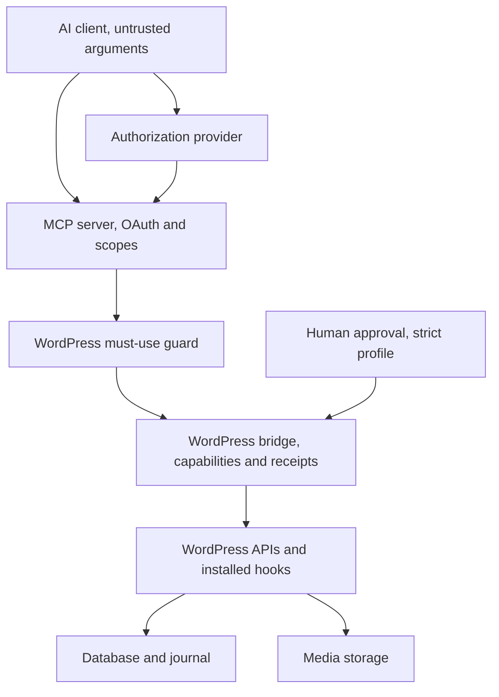

# Architecture

Gate 0 established the component split. The detailed Gate 1 design below is accepted. C01 package/test scaffolding is human-accepted and merged on main after verification across the required matrix. C02: Independent MU Guard is IN PROGRESS on its dedicated branch, with the bounded custom-server correction published but verification blocked by an incomplete matrix (four jobs passed, five cancelled before execution), pending human acceptance. No real bridge handler, C03 foundation or MCP implementation exists.

## Components and authority

The TypeScript MCP server uses an official SDK, with a pinned version selected and verified in Gate 4. It owns client authentication, fixed tool schemas, scopes, protective limits, controlled client-file retrieval, durable mutation admission/handle allocation, bridge request shaping, safe errors and model-result projection. Internal audit correlation is kept in protected records. It has no WordPress database credential or filesystem access. It never directly modifies the database/files or exposes a generic REST proxy.

The WordPress PHP package contains a minimal must-use guard and bridge feature handlers. The guard restricts dedicated service identities to the fixed bridge route table and remains effective when handlers are absent. The bridge independently owns WordPress authentication checks, native/custom capabilities, schema and operation validation, approval-profile enforcement, durable mutation deduplication, WordPress API calls, fresh readback and receipts. Installation must establish the guard before issuing a service credential.

An established, self-hostable OAuth provider handles login, consent and token issuance. Coagmentator is an OAuth resource server, not a new authorization-server implementation. Its compatibility contract is in [AUTHENTICATION.md](AUTHENTICATION.md).

Shared contracts live as design documentation in [CONTRACTS.md](CONTRACTS.md), [ERRORS.md](ERRORS.md) and [MCP-TOOLS.md](MCP-TOOLS.md). Implementation packages come later. Both components validate the same explicit contract version; neither infers meaning from undocumented WordPress REST fields.

## Trust boundaries

| Boundary | What crosses it | Enforced owner/control |
| --- | --- | --- |
| AI client to MCP | Untrusted JSON tool inputs, user-delegated access token | MCP validates token, subject/site binding, scopes, schema, limits and Origin; no model obedience assumption |
| Client/provider/MCP | OAuth discovery, callback and token state | Established provider plus client implement PKCE/issuer/redirect checks; MCP pins issuer/audience and validates every access token |
| MCP to bridge | Fixed HTTPS route, dedicated Application Password, versioned envelope | Guard checks identity/route; bridge independently enforces native/custom capabilities, site, policy and request validity. Claimed actor is audit context, not extra authority |
| Human browser to approval UI (strict policy) | Cookie session, CSRF nonce, explicit approval POST | Bridge requires a non-service human identity, approval and underlying capabilities, exact-intent binding and expiry. No MCP approval tool; service cannot change profile |
| Bridge to WordPress core/hooks | Validated narrow API call | WordPress capabilities remain authoritative; plugin hooks share its trust domain and can affect results. Verify actual readback |
| WordPress to database/files | Content, media, private approval payloads and audit journal | WordPress APIs for content; prepared internal journal operations only; no remote SQL or path input. Persistent unique reservation supports deduplication |
| Client-file service to MCP | Untrusted temporary file locator and raster bytes | Exact reviewed source profile, public-address connection pinning, HTTPS, no redirects, streaming limits, decoder validation and server digest; no arbitrary URL downloader |
| External content and bridge media | Raw post text/revisions, validated raster bytes, returned resource URLs | No content rendering or returned-URL fetching. Bridge accepts byte envelope only, independently validates and re-encodes media; URLs remain untrusted data |

## Fixed deployment identity

The MVP has one site, one configured OAuth operator and one dedicated WordPress service identity per MCP instance. Bind the canonical MCP audience, approved issuer/subject, actor ID, bridge HTTPS endpoint, service-user/credential UUIDs, and random bridge site ID out of band. Tools never accept a site URL or credentials. No model-facing tool requires or accepts that site ID. MCP injects it into every bridge envelope, including `site_info`, and verifies it on responses. Actor/correlation IDs and timestamps are also trusted infrastructure fields, never model bookkeeping. A site clone must receive a new ID and new credentials before use. Multisite and multiple-site routing require a later review.

WordPress Application Passwords do not provide this route boundary themselves. The mandatory guard closes native REST/XML-RPC/self-management bypasses; [CAPABILITIES.md](CAPABILITIES.md) documents the residual risk if a trusted operator removes the guard without revoking credentials.

## Mutation lifecycle

Validate transport/identity and operation authority before disclosing resource state. For a write, MCP allocates and durably persists the request handle/timestamp and intent fingerprint before dispatch. Handle-less duplicate recovery returns the saved handle rather than issuing another write. The bridge validates every field, persists its independent request hash and reservation, applies the configured approval profile and obtains strict exact-intent approval when required. It claims execution once, acquires bounded bridge resource locks, reauthorizes and rechecks the version/editor lock, executes the narrow WordPress mutation, then reads fresh state and compares intended/preserved fields. Persist the complete protected receipt with the observed outcome; MCP validates it and returns only the documented useful evidence projection. No success can be manufactured during projection.

Duplicate keys with changed intent are conflicts. Concurrent callers cannot share execution ownership. Timeout or crash after execution intent is recorded is indeterminate until reconciled; never steal the reservation or blindly run the mutation again. `get_mutation` only reads status. All mutation outputs distinguish applied, partial and unknown outcomes. No guarantee of exactly-once external hook effects, rollback across files/DB, or atomic concurrency with unrelated WordPress writers.

The bridge journal stores unique request keys, canonical hashes, ownership/state transitions, compact results and receipts for 90 days. MCP also persists generated handles, original timestamps and fingerprints so network/client response loss cannot allocate an accidental second operation. Unresolved tombstones remain until operator reconciliation; quota exhaustion stops admission. Private pending approval and MCP continuity payloads are separately access-controlled and erased within 24 hours, with 10-minute approval expiry. Logs contain no payload bodies or credentials. A crash may leave a partial media file or operation; the operator reconciles it instead of automatic destructive cleanup.

## MVP surface and content policy

Exactly 21 operations are defined in [MCP-TOOLS.md](MCP-TOOLS.md), with full authorization in [CAPABILITIES.md](CAPABILITIES.md). Ten are reads and eleven are mutations. Post/page lookup is unified, creation is draft-only, and publication and Trash are separate operations. Every mutation uses a stable server-generated request key returned to the client; existing-resource writes require a current full-projection version.

Native capabilities plus custom operation caps provide least privilege. Write families default off in both profiles. `strict` requires independent human approval for live/private edits, publication, Trash, uploads, term edits and revision restore. `trusted_single_operator` supports those explicitly enabled families with standing server authorization and client confirmation behavior. The bridge pins profile/policy out of band; a service identity cannot downgrade it. Both retain every capability, version, deduplication and verification check. A compromised MCP host can exercise all enabled trusted-profile writes; client confirmation does not attest intent to WordPress. Strict policy preserves the extra independent boundary.

Content reads return stored raw source without executing blocks/shortcodes. Writes support a fixed safe HTML/static-block subset. The external media tool uses OpenAI file parameters; MCP validates a controlled download and forwards a bounded byte contract. WordPress never receives a URL or performs URL sideloads. Metadata keys are fixed; optional bridge-owned basic SEO requires verified sole ownership of title/description output and does not claim compatibility with existing SEO vendors. These limitations are product scope, not hidden implementation exceptions.

## Repository and gate boundaries

Continue the monorepo layout planned in Gate 0: `apps/mcp-server/`, `wordpress/coagmentator/`, `packages/contracts/`, `tests/`, and `docs/`. Only documentation is created in Gate 1. Gate 2 builds the WordPress read foundation and must-use guard; Gate 3 builds mutations, both bridge policy profiles, strict approval UI and journal; Gate 4 builds the MCP/OAuth adapter, durable handle ownership, file retrieval and result projection. Gates 5 and 6 validate non-production then separately authorized production use. Do not silently implement a later gate.

[SECURITY.md](SECURITY.md) owns security invariants; [THREAT-MODEL.md](THREAT-MODEL.md) traces concrete attacks and residual risks; [ROADMAP.md](ROADMAP.md) owns status and acceptance. Work notes are evidence and handoffs, not alternate contracts.

## C02 implementation boundary

The independent package consists of the root MU loader and its five support classes. The loader retains denial and minimal failure encoding when support code is missing. The protected registry is operator-owned canonical JSON outside the web root, separate from the minimal feature-readiness file. Its user IDs impose restrictions even after role promotion or marker removal. WordPress-side service metadata only adds denial.

The guard copies only authenticated user ID and matched credential UUID from core's Application Password events. The MU server owns one external dispatch scope, checks exact method/path and callback identity before validation, observes current-user changes and retains restrictions through nested or subsequent calls. Its expected future normal-plugin callback is the already-loaded final `Coagmentator\Rest\ReadController`, from the fixed package path, with operation-named methods and `authorize_guard_request`. The guard does not load or ship that class. C02 finalization only emits closed failures; it has no success serializer or read implementation. Broader binding, capability and operational controls remain C03/later work.

A competing REST server selection is an unsupported Coagmentator environment and fails guard preflight before credential issuance. The guard preserves that custom selection for ordinary public and human REST instead of replacing it or recording a global authentication failure. Existing server-identity, authentication and dispatch checks deny all bridge access and protected/marked service access under the custom server. It is never implicitly trusted. Removing the competing selection restores the normal guarded server and preflight path on the next request.

Missing registry/support triggers global remote-credential denial while core-validated human login/cookies, admin recovery and public anonymous traffic remain available. Disposable verification and exact execution evidence are recorded in the [security harness](../tests/security/README.md) and [C02 handoff](work-notes/2026-10-05-gate-2-c02-independent-mu-guard.md). No production installation or provisioning has occurred.
